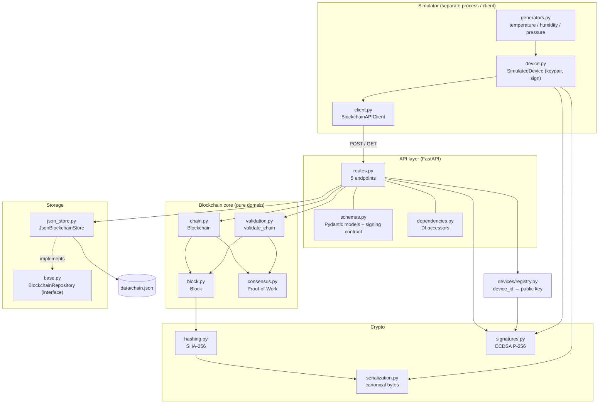
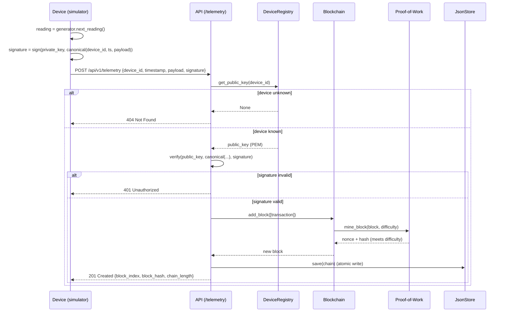

# Architecture

## Overall Architecture

The system is organised in **layers with one-directional dependencies**. Higher
layers depend on lower ones; the blockchain core has no knowledge of HTTP, files,
or the web framework. This keeps each layer independently testable and makes the
storage backend swappable.

```
Simulator (client)  ──HTTP──>  API layer  ──>  Blockchain core  ──>  Crypto
                                   │                  │
                                   ├──> Device registry
                                   └──> Storage  ──>  data/chain.json
```



## Component Responsibilities

| Component | File(s) | Responsibility |
|-----------|---------|----------------|
| Canonical serialization | `crypto/serialization.py` | Deterministic bytes (sorted keys, no whitespace) for hashing & signing |
| Hashing | `crypto/hashing.py` | `sha256_hex` (bytes) and `hash_object` (canonical object → digest) |
| Signatures | `crypto/signatures.py` | ECDSA P-256 keygen, PEM (de)serialization, `sign`, `verify` |
| Block | `blockchain/block.py` | Block fields + content-derived hash, `to_dict`/`from_dict` |
| Consensus | `blockchain/consensus.py` | `is_valid_proof`, nonce-based `mine_block` (adjustable difficulty) |
| Chain | `blockchain/chain.py` | Genesis creation, mined appends, ordering/linking, (de)serialization |
| Validation | `blockchain/validation.py` | `validate_chain` → hash integrity, PoW, links, ordering, genesis |
| Storage interface | `storage/base.py` | `BlockchainRepository` ABC + `StorageError` + `load_or_create` |
| JSON storage | `storage/json_store.py` | Atomic save, graceful-failure load |
| Device registry | `devices/registry.py` | In-memory `device_id → public key` lookup |
| API | `api/*.py` | Endpoints, validation, DI, lifespan startup |
| Simulator | `simulator/*.py` | Signed telemetry from 3 sensors (HTTP client) |

## Blockchain Workflow

1. A device produces a reading `{value, unit}` and a timestamp.
2. It builds the **signable** structure `{device_id, timestamp, payload}` and
   ECDSA-signs the canonical bytes of it.
3. The reading + signature is POSTed to the API.
4. The API looks up the device's public key and **verifies** the signature.
5. The verified reading becomes a **transaction**; a new block is created with
   the next index and `previous_hash = tip.hash`.
6. The block is **mined** (Proof-of-Work): the nonce is incremented until the
   block hash has the required leading zeros.
7. The block is appended and the whole chain is **persisted** to JSON.
8. `validate_chain()` can re-verify the entire chain at any time.

## Sequence Diagram — Telemetry Ingestion



## Data Flow

- **Inbound (write):** Device → JSON over HTTP → Pydantic validation → signature
  verification → transaction → mined block → in-memory chain → `data/chain.json`.
- **Outbound (read):** `GET /chain` serializes the in-memory chain;
  `GET /device/{id}` flattens blocks and filters by device; `GET /validate` runs
  `validate_chain` over the in-memory chain.
- **Restart:** On startup the store loads `data/chain.json` (or creates a new
  chain). The chain is restored exactly; block hashes recompute identically, so
  validation still passes. (The device registry is **not** persisted — see below.)

## Security Model

**What is protected**

| Threat | Mechanism | Where |
|--------|-----------|-------|
| Forged/altered reading in transit | ECDSA signature verified against registered public key | `POST /telemetry` (`signatures.verify`) |
| Tampering with stored history | SHA-256 hash chaining + Proof-of-Work; recompute & compare | `validate_chain` / `GET /validate` |
| Key-order / formatting ambiguity | Canonical serialization (sorted keys, compact, UTF-8) | `crypto/serialization.py` |
| Corrupt/partial file on crash | Atomic write (temp + `os.replace`) | `json_store.save` |

**Current limitations (by design, for a prototype)**

- `validate_chain` checks **structural integrity** (hashes, PoW, links,
  ordering, genesis) but does **not** re-verify each transaction's ECDSA
  signature — signatures are verified only at ingestion. (The signature is stored
  in the block, so this could be added later.)
- The **device registry is in-memory**: after a restart, the chain is restored
  but registered devices are not, so devices must re-register before sending.
- Each accepted reading becomes **its own block** (one transaction per block).
  `MEMPOOL_BLOCK_SIZE` exists in config but batching is not yet wired up.
- **No transport security / auth** on read endpoints; single-process with a
  write lock (not multi-node consensus).

## Design Decisions

| Decision | Why |
|----------|-----|
| **ECDSA (P-256)** over RSA | Smaller keys, faster sign/verify — realistic for resource-constrained IoT |
| **Proof-of-Work** over PoA | The spec asks for adjustable difficulty; PoW best illustrates mining/nonce |
| **JSON file** over SQLite (first) | Human-readable: you can open `chain.json` and tamper with it to *see* detection work |
| **Storage behind an interface** | Swap JSON → SQLite later with no change to API/blockchain (dependency inversion) |
| **Canonical serialization in one place** | Eliminates the #1 hash/signature bug source (key-order mismatch) |
| **Simulator as a separate package** | It's a client, not the server; keeps boundaries honest |
| **App factory + lifespan** | Clean startup/state and easy dependency injection for tests |
| **One block per reading** | Simplest correct behavior for a prototype; batching deferred |
